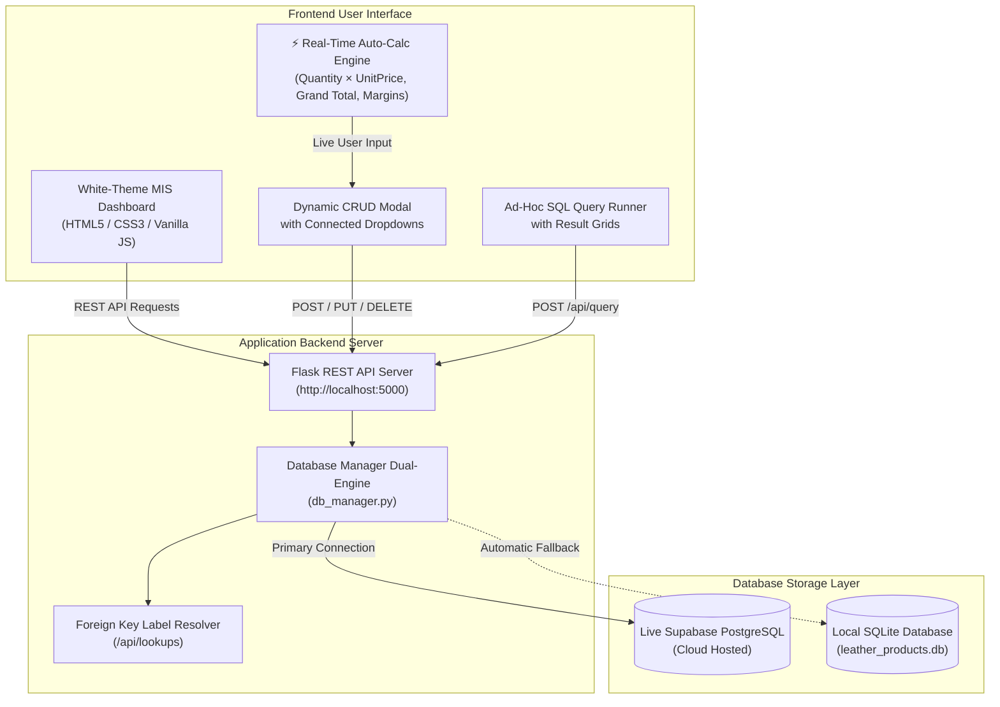
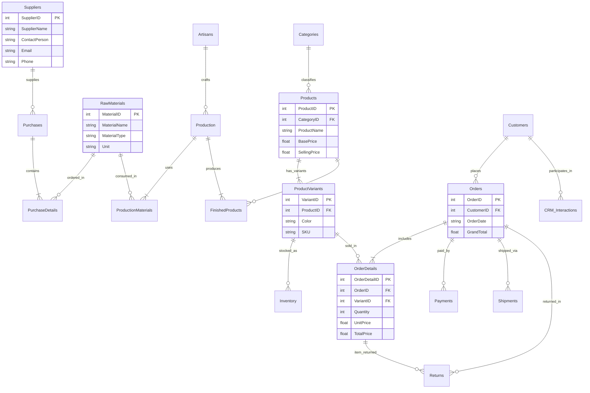

# 👜 Handmade Leather Products — Business Data Management (BDM) & MIS Platform

[](https://supabase.com)
[](https://flask.palletsprojects.com)
[](file:///dashboard.html)
[](file:///schema_leather.sql)

An end-to-end **Business Data Management (BDM)** system, relational database architecture, and interactive **Management Information System (MIS)** dashboard for **Aethelgard Leatherworks** — a luxury handmade leather goods manufacturer and direct-to-consumer (D2C) brand.

---

## 📑 Table of Contents
- [Executive Overview](#-executive-overview)
- [System Architecture](#-system-architecture)
- [Relational Database Schema (24 Tables)](#-relational-database-schema-24-tables)
- [Entity-Relationship Diagram (ERD)](#-entity-relationship-diagram-erd)
- [White-Theme MIS Dashboard & CRUD System](#-white-theme-mis-dashboard--crud-system)
- [Connected Dropdown Foreign Key Resolver](#-connected-dropdown-foreign-key-resolver)
- [Real-Time Automatic Calculation Engine](#-real-time-automatic-calculation-engine)
- [Advanced SQL Analytics Suite (15 Queries)](#-advanced-sql-analytics-suite-15-queries)
- [Project Directory Structure](#-project-directory-structure)
- [Installation & Setup Instructions](#-installation--setup-instructions)
- [REST API Endpoints](#-rest-api-endpoints)

---

## 🌟 Executive Overview

Handcrafted luxury leather goods businesses face multi-layered operational complexities across **raw material sourcing** (hides, threads, solid brass hardware), **artisan guild workshop manufacturing**, **inventory management** with SKU color variations, **omnichannel order fulfillment**, and **CRM/returns processing**.

This system delivers:
1. **Normalized PostgreSQL Schema**: 24 relational tables enforcing primary keys, foreign keys, cascading constraints, check constraints, and performance indexes.
2. **Dual-Engine Persistence**: Direct connection to cloud-hosted **Supabase PostgreSQL** with automated fallback to local **SQLite** (`leather_products.db`).
3. **White-Themed MIS/CRUD Dashboard**: Clean, modern interface styled with saddle tan accents, responsive data tables, instant search, and CSV export.
4. **Human-Readable Connected Selectors**: Replaces cryptic numerical IDs with contextual labels (e.g. *Customer Name*, *Artisan Name*, *Supplier Name*, *Product Variant SKU*).
5. **Real-Time Client & Server Auto-Calculations**: Automatic computation for order totals, line items, batch production costs, gross margins, and freight deductions.

---

## 🏗 System Architecture



---

## 🗄 Relational Database Schema (24 Tables)

The database covers **5 core business modules**:

### 1. Supply & Procurement
- **`Suppliers`**: Leather tanneries, hardware vendors, and dye suppliers with contact and tax details.
- **`RawMaterials`**: Raw hide types (Veg-Tanned, Top-Grain, Suede), linen thread, and hardware specifications.
- **`Purchases`**: Purchase invoices raised with vendor payment statuses (`Paid`, `Pending`, `Partial`).
- **`PurchaseDetails`**: Line items for material procurement (`Quantity`, `UnitPrice`, `TotalPrice`).

### 2. Manufacturing & Workshop
- **`Artisans`**: Master craftsmen, leather crafters, apprentices, and daily labor rates.
- **`Production`**: Production work orders and workshop batch schedules.
- **`ProductionMaterials`**: Raw material consumption tracked per production batch.
- **`FinishedProducts`**: Completed items produced per batch with computed unit production costs.

### 3. Inventory & Products
- **`Categories`**: Product categories (*Handcrafted Wallets*, *Luxury Bags*, *Belts*, *Travel Gear*, *Tech Folios*).
- **`Products`**: Master product catalog with base manufacturing cost and retail selling price.
- **`ProductVariants`**: Specific color, size, and leather finish variations with unique SKUs.
- **`Inventory`**: Stock tracking per variant with `QuantityInHand`, `ReservedQuantity`, and `ReorderLevel`.

### 4. Sales & E-Commerce / CRM
- **`Customers`**: Customer profiles, email, phone, and billing/shipping addresses.
- **`Orders`**: Customer sales orders with `TotalAmount`, `DiscountAmount`, `ShippingAmount`, and `GrandTotal`.
- **`OrderDetails`**: Order line items referencing specific product variants.
- **`Payments`**: Payment transactions with method (*Credit Card*, *Stripe*, *PayPal*, *Bank Transfer*) and status.
- **`Shipments`**: Courier dispatch details, tracking numbers, and delivery status tracking.
- **`Returns`**: Customer return requests, inspection reasons, and refund amounts.
- **`Discounts_Promotions`**: Promo coupon codes, percentage/fixed discounts, and validity periods.
- **`Leads`**: Inbound sales leads from social campaigns and trunk shows.
- **`CRM_Interactions`**: Customer touchpoints, support tickets, and follow-up reminders.

### 5. Master & Operations Support
- **`Employees`**: Store managers, workshop supervisors, and fulfillment staff.
- **`Expenses`**: Operational overhead expenses (*Workshop Rent*, *Machinery*, *Utilities*, *Packaging*).
- **`Addresses`**: Physical delivery and warehouse addresses.
- **`Settings`**: Global configuration key-values (*Store Name*, *Tax Rates*, *Freight Thresholds*).

---

## 📊 Entity-Relationship Diagram (ERD)



---

## 🎨 White-Theme MIS Dashboard & CRUD System

The web dashboard is built following clean, modern UI/UX design standards:
- **Light Color Palette**: Clean white background (`#FFFFFF`), slate borders (`#E2E8F0`), and saddle tan brand accents (`#C2672B`).
- **Interactive Navigation**:
  1. **All Tables & CRUD Explorer**: Full dynamic CRUD grid across all 24 tables with instant search, pagination, and CSV export.
  2. **Executive & Financial Analytics**: High-level KPI cards (Gross Revenue, AOV, Inventory Asset Value, Active Artisans) and interactive Chart.js graphs.
  3. **Live SQL Query Runner**: Direct interactive query interface with response timing and execution feedback.
  4. **Relational Schema Viewer**: Visual directory of all 24 tables and their foreign key dependencies.

---

## 🔗 Connected Dropdown Foreign Key Resolver

Instead of displaying or requesting raw numerical foreign key IDs, the system automatically resolves and presents human-readable labels:

| Foreign Key Field | Resolved Display Label |
| :--- | :--- |
| `CategoryID` | Category Name (e.g. *Handcrafted Wallets*, *Luxury Bags*) |
| `SupplierID` | Supplier Name & City (e.g. *Conceria Walpier Tannery (Tuscany)*) |
| `MaterialID` | Material Name & Type (e.g. *Italian Buttero Veg-Tanned Leather*) |
| `ArtisanID` | Artisan Name & Specialization (e.g. *Marco Rossi (Master Leather Crafter)*) |
| `CustomerID` | Customer Full Name & Email (e.g. *Eleanor Vance (eleanor@example.com)*) |
| `ProductID` | Product Name (e.g. *The Heritage Bifold Wallet*) |
| `VariantID` | Product Name + Color + SKU (e.g. *The Executive Briefcase (Cognac Brown - SKU: BRF-CGN-01)*) |
| `OrderID` | Order # + Date + Grand Total (e.g. *Order #1001 ($895.00)*) |

---

## ⚡ Real-Time Automatic Calculation Engine

The system features real-time client-side calculation listeners hooked to `['input', 'change', 'keyup', 'paste', 'blur']` events, accompanied by visual formula breakdown badges:

```
┌─────────────────────────────────────────────────────────────┐
│ ⚡ Auto-Calculated: 890 units × $7,008.00 = $6,237,120.00   │
└─────────────────────────────────────────────────────────────┘
```

### Supported Formulas:
1. **`PurchaseDetails`**:
   $$\text{TotalPrice} = \text{Quantity} \times \text{UnitPrice}$$
2. **`OrderDetails`**:
   $$\text{TotalPrice} = (\text{Quantity} \times \text{UnitPrice}) - \text{Discount}$$
3. **`Orders`**:
   $$\text{GrandTotal} = \text{TotalAmount} - \text{DiscountAmount} + \text{ShippingAmount}$$
4. **`FinishedProducts`**:
   $$\text{ProductionCost} = \text{QuantityProduced} \times \text{UnitCost}$$
5. **`Products` (Live Margin Feedback)**:
   $$\text{Gross Profit Margin (\%)} = \frac{\text{SellingPrice} - \text{BasePrice}}{\text{SellingPrice}} \times 100$$
6. **Universal Fallback Engine**: Automatically computes any $\text{Quantity} \times \text{Price}$ input pair across any form.

---

## 📈 Advanced SQL Analytics Suite (15 Queries)

The file [leather_analytics_queries.sql](file:///c:/Users/athir/OneDrive/Desktop/Malavika/BDM/Assignment/leather_analytics_queries.sql) contains 15 production-grade SQL analytical queries:

1. **Executive P&L Summary**: Gross sales, returns, discounts, net revenue, COGS, operating expenses, and net profit.
2. **Product Margin & Profitability Analysis**: Category-level profit margin % and unit gross profit ranking.
3. **Artisan Guild Productivity & Unit Output**: Completed production batches and labor costs per craftsman.
4. **Raw Material Sourcing Spend by Supplier**: Total procurement expenditure and purchase volume.
5. **Inventory Asset Valuation & Reorder Alerts**: Stock value computation with automatic reorder status flags.
6. **Customer Lifetime Value (CLV) & Loyalty Tiering**: VIP customer segmentation ($1,000+ spenders).
7. **Monthly Sales Growth & Running Revenue (Window Functions)**: Month-over-month sales velocity.
8. **Top Selling Products by Revenue & Quantity**: Best-performing leather goods ranking.
9. **Fulfillment Cycle Time & Delivery SLA Performance**: Average dispatch and transit duration.
10. **Customer Return Rate Analysis**: Return percentage and primary return reasons.
11. **Discount Campaign ROI & Promotion Utilization**: Revenue generated per promo coupon.
12. **CRM Lead Conversion Funnel**: Lead conversion rates across marketing channels.
13. **Operating Expense Distribution by Category**: Breakdown of operational overheads.
14. **Production Material Yield & Scrap Tracking**: Material consumption ratios per batch.
15. **Unfulfilled / High-Value Pending Orders**: Active orders requiring warehouse fulfillment.

---

## 📁 Project Directory Structure

```
├── schema_leather.sql             # PostgreSQL DDL for 24 relational tables
├── seed_leather.sql               # Realistic seed data SQL script
├── seed_leather_data.py           # Python seeder script for Supabase / SQLite
├── leather_analytics_queries.sql  # 15 analytical SQL queries
├── db_manager.py                  # Dual-engine Database Manager & Schema Resolver
├── server.py                      # Flask REST API backend server
├── dashboard.html                 # Standalone synchronized dashboard
├── templates/
│   └── index.html                 # Active web dashboard with connected dropdowns & auto-calc
├── leather_products.db            # Local SQLite fallback database
├── requirements.txt               # Python package dependencies
├── .env                           # Supabase connection configuration
└── README.md                      # Comprehensive project documentation
```

---

## 🚀 Installation & Setup Instructions

### 1. Prerequisites
- **Python 3.9+** installed on your system.
- *(Optional)* A **Supabase PostgreSQL** database instance.

### 2. Clone / Open the Repository
```bash
git clone https://github.com/malavikavenugopal/BDM_Assignment_Group8.git
cd BDM_Assignment_Group8
```

### 3. Install Dependencies
```bash
pip install -r requirements.txt
```

### 4. Configure Database Credentials
Create or edit your `.env` file:
```env
DATABASE_URL=postgresql://postgres:[YOUR_PASSWORD]@[YOUR_HOST]:5432/postgres
```
> *Note: If no Supabase connection string is supplied, the system automatically uses the bundled, pre-seeded local SQLite database (`leather_products.db`).*

### 5. Seed Database *(Optional)*
To re-initialize and seed the database tables:
```bash
python seed_leather_data.py
```

### 6. Launch the Server & Dashboard
```bash
python server.py
```
Open **[http://localhost:5000](http://localhost:5000)** in any web browser.

---

## 🔌 REST API Endpoints

| Method | Endpoint | Description |
| :--- | :--- | :--- |
| `GET` | `/api/kpis` | Returns executive KPIs (Revenue, AOV, Inventory Value, Artisans) |
| `GET` | `/api/charts` | Returns chart dataset breakdowns (Category Sales, Expenses) |
| `GET` | `/api/tables` | Lists all 24 tables with their module groupings and row counts |
| `GET` | `/api/table/<name>?search=` | Retrieves records for a specific table with optional search query |
| `GET` | `/api/schema/<name>` | Returns column definitions, data types, PK, and FK options for a table |
| `GET` | `/api/lookups` | Returns comprehensive ID-to-Label mappings for all relational entities |
| `POST` | `/api/records/<name>` | Inserts a new record into the specified table |
| `PUT` | `/api/records/<name>/<id>` | Updates an existing record by Primary Key |
| `DELETE` | `/api/records/<name>/<id>` | Deletes a record by Primary Key |
| `POST` | `/api/query` | Executes an ad-hoc SQL query and returns result columns & rows |
| `GET` | `/api/mis_summary` | Returns a consolidated operational summary |

---

## 👥 Contributors
- **Group 8** — Business Data Management (BDM) Course Assignment
- **Aethelgard Leatherworks MIS Platform**
